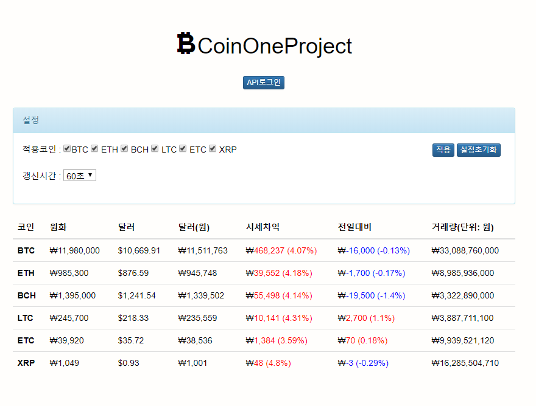
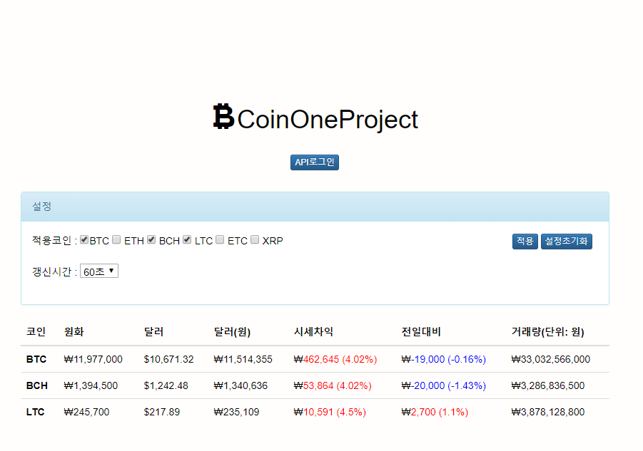
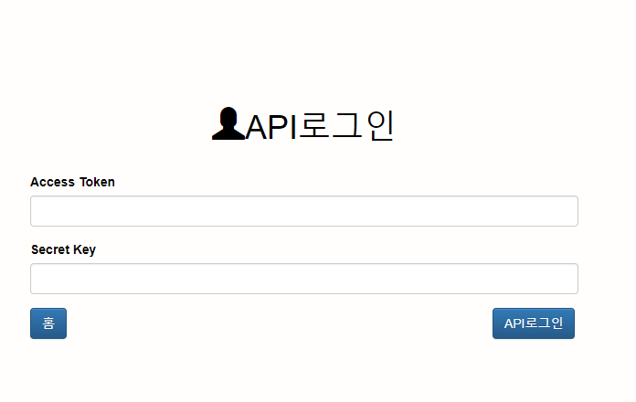
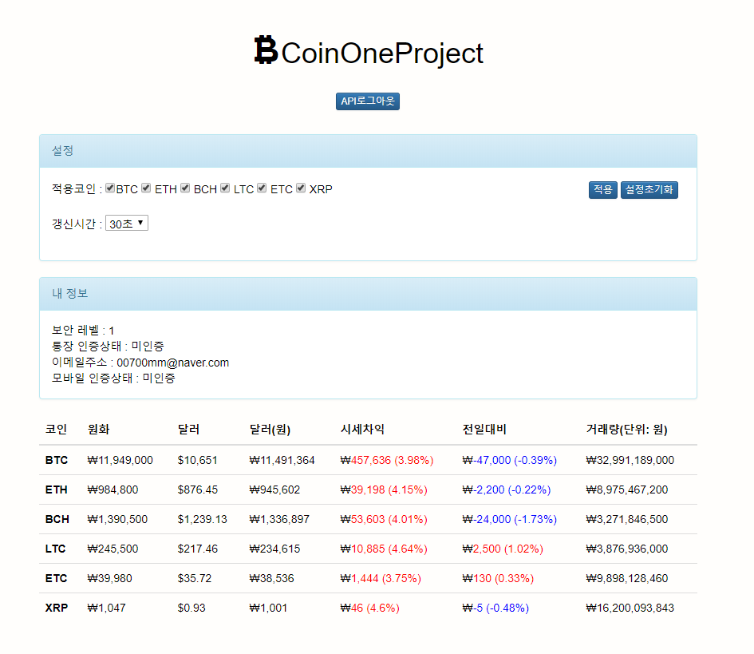

# CoinOneProject

## 프로그램의 목적

국내 암호화폐 거래소의 시세와 외국 암호화폐 거래소의 시세 차익을
보여주는 웹 사이트 입니다.
그리고 임시로 발급받은 API키를 이용하여 코인원 계정의
내 정보를 조회할 수 있도록 구현하였습니다.(추후에 oauth를 이용하여
    구현 계획에 있음)

## 프로그램의 설명

### 프로그램의 기능

  - 코인원 암호화폐 시세 조회
    - public api인 ticker를 활용하였습니다.
  - Poloniex 암호화폐 시세 조회
    - public api인 ticker를 활용하였습니다.
  - 코인원과 Poloniex 시세의 차익 조회(%비율)
    - 환율 API를 활용하였습니다.
    - 코인원 시세와 poloniex의 달러원화의 차를 이용하였습니다.
  - 전일 대비 시세 조회(%비율)
    - yesterdaylast값과 현재 값인 last값의 차를 이용하였습니다.
  - 내 정보(코인원) 조회 기능
    - 임시로 발급받은 API키를 이용하였습니다.
    - 보안 레벨
    - 통장 번호
    - 이메일 주소
    - 휴대폰 번호

### 프로그램 이미지

